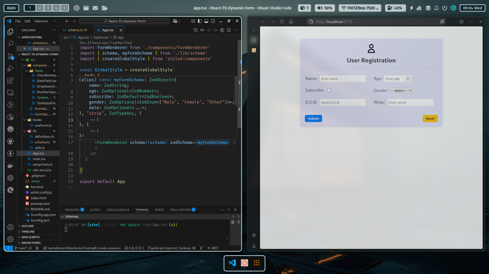

# 🧩 Dynamic Form Renderer

A lightweight, schema-driven form builder built with **React**, **TypeScript**, and **Vite**. This app dynamically renders forms based on a JSON schema, demonstrating clean component architecture, internal state handling, and validation with Zod.

---

## 🚀 Features

- 🔧 **Dynamic form rendering** from a JSON schema  
- 📦 Internal state management via a custom `useForm` hook  
- ✅ **Validation** with Zod for required and typed fields  
- 🧱 Modular and reusable field components  
- 💾 JSON display of submitted data  
- 🎨 Clean, responsive UI with styled-components  
- 🔁 Easily extendable for additional field types (e.g., dates)

---

## 🛠 Tech Stack

- ⚡ [Vite](https://vitejs.dev/) + [React](https://reactjs.org/)
- 🧠 TypeScript
- 🎨 [styled-components](https://styled-components.com/)
- ✅ [Zod](https://zod.dev/) for schema validation
- 🧪 (Optional) [Vitest](https://vitest.dev/) + [React Testing Library](https://testing-library.com/docs/react-testing-library/intro/) for unit tests

---

## 📦 Getting Started

### 1. Clone the repo

```bash
git clone https://github.com/theWhiteFox/React-TS-Dynamic-Form.git
cd React-TS-Dynamic-Form
```

### 2. Install dependencies
```
bun install
# or
npm install
```
### 3. Start the dev server
```
bun dev
# or
npm run dev
```

## 🧠 Design Notes
- The form is schema-driven and assumes a trusted schema source
- Each field is rendered using a reusable component based on its type
- Validation is handled via a zodSchema passed into the renderer
- The internal form state is strongly typed and centrally managed
- Easily extendable to add more validations or custom field types

## 🗂 Project Structure

```bash
react-ts-dynamic-form/
├── public/
├── src/
│   ├── __tests__/               # (Optional) Unit tests
│   ├── components/
│   │   ├── FormRenderer.tsx     # Main renderer component
│   │   ├── FormWrapper.ts       # Styled container & layout
│   │   └── fields/              # Field components
│   │       ├── CheckboxField.tsx
│   │       ├── SelectField.tsx
│   │       ├── NumberField.tsx
│   │       ├── TextField.tsx
│   │       └── DateField.tsx    # Bonus: easily extendable
│   ├── hooks/
│   │   └── useForm.ts           # Custom hook for state/validation
│   ├── lib/
│   │   ├── definitions.ts       # Schema & field types
│   │   ├── schema.ts            # Sample schema definition
│   │   └── utils.ts             # (Optional) helper functions
│   ├── App.tsx
│   ├── main.tsx
├── index.html
├── vite.config.ts
├── package.json
└── README.md

```

### Running locally this is what you will see 🤞



## 📝 Learning Reflection

I'm also writing a blog post to reflect on what I learned during this project — including dynamic component rendering, Zod validation patterns, and managing typed form state. [Read the post here](https://www.thewhitefoxdev.blog/blog/React-TS-Dynamic-Form)
